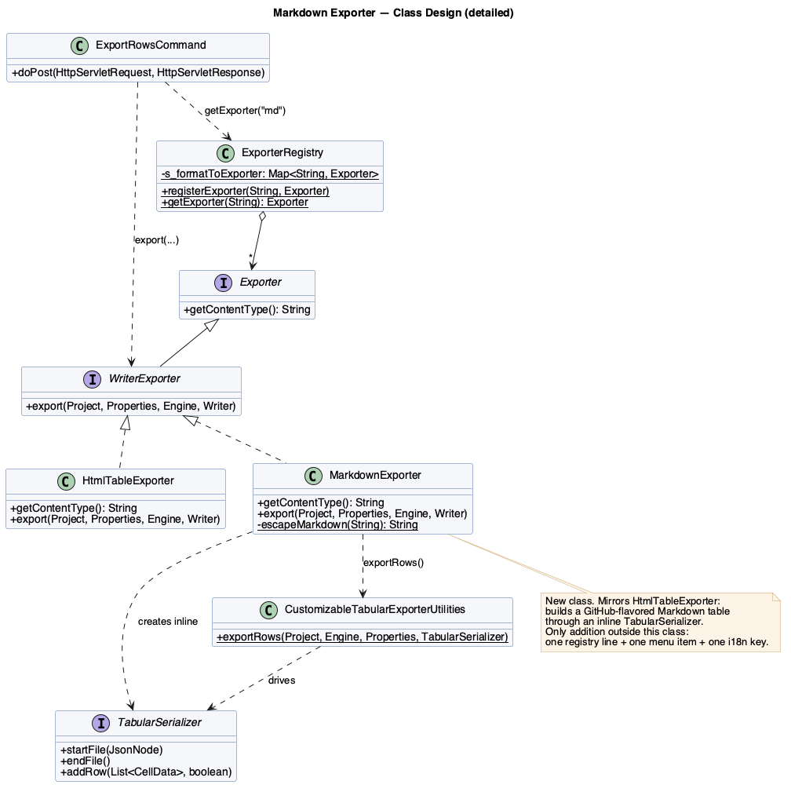
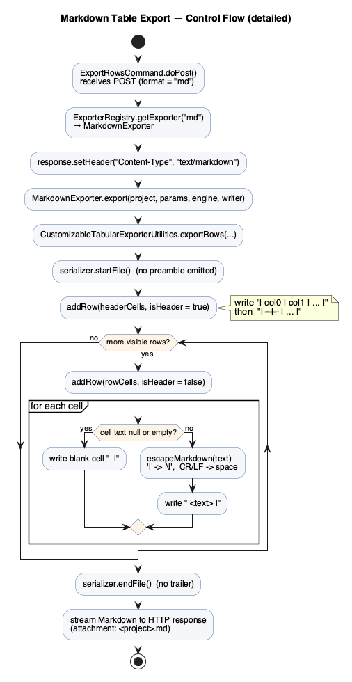
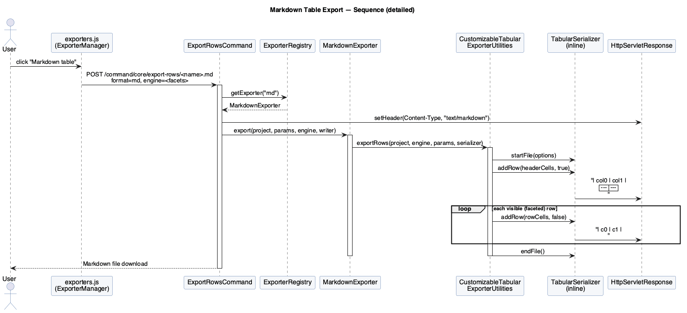
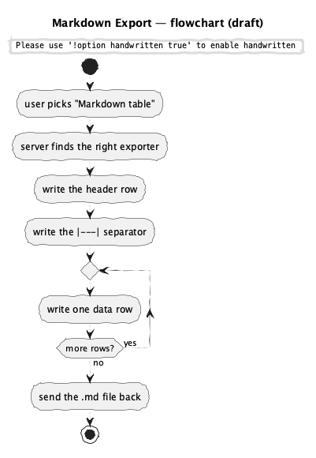
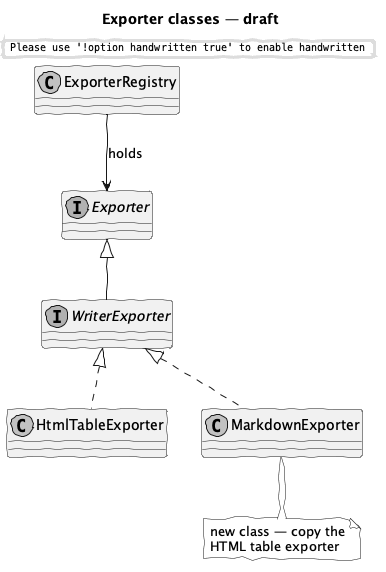
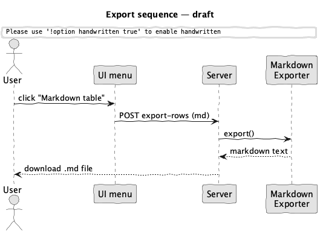

# Design Document — Markdown Table Exporter

**Project:** [OpenRefine](https://github.com/OpenRefine/OpenRefine)

**Team members:** Kingson Zhang, Mouhamed Osman, Zhenyu Song, Zian Xu

---

## 1. Feature description

Add a new **"Markdown table"** export format to OpenRefine. From the existing **Export** menu, the user picks *Markdown table* and the current view of the project — respecting all active facets and filters — is downloaded as a GitHub-flavored Markdown (GFM) table:

```markdown
| Country | Population | Capital |
| --- | --- | --- |
| France | 68000000 | Paris |
| Japan | 125000000 | Tokyo |
```

The first data row is the column headers, the second is the `| --- |` separator GFM requires, and every following row is one data row. Cell text that would break the table — `|` characters and line breaks — is escaped.

## 2. Motivation

OpenRefine is, at its core, a tool for *cleaning data so it can be used somewhere else*. Its current text exporters target spreadsheets (CSV/TSV), web pages (HTML table), and databases (SQL). None of them produce the format that developers and technical writers paste data into most often today: Markdown.

Markdown tables are the lingua franca of READMEs, GitHub issues and pull requests, wikis, Jupyter notebooks, and static-site documentation. Today a user who wants a cleaned table in their docs has to export CSV and run it through a separate converter, or hand-format the table. A native exporter removes that friction for a very common destination, at a very small implementation cost. It is a meaningful, user-facing addition that fits squarely within OpenRefine's existing "export the grid" capability.

## 3. Relevant current aspects of the system

OpenRefine already has a small, well-factored **exporter subsystem**. A new format plugs into it without touching the request-handling code — this is the property that makes the feature cheap and safe.

**Strategy + Registry.** Every export format is a strategy implementing the `Exporter` interface; text formats implement its `WriterExporter` sub-interface. All strategies are looked up by name in a single `ExporterRegistry`.

| Concern | Type | Path |
| --- | --- | --- |
| Strategy interface | `Exporter` / `WriterExporter` | `modules/core/src/main/java/com/google/refine/exporters/` |
| Row-iteration helper | `CustomizableTabularExporterUtilities` + `TabularSerializer` | same package |
| Registry | `ExporterRegistry` | same package |
| Request dispatcher | `ExportRowsCommand` | `main/src/com/google/refine/commands/project/` |
| Registration | `registerExporters()` | `main/webapp/modules/core/MOD-INF/controller.js` |
| Export menu | `ExporterManager.MenuItems` | `main/webapp/modules/core/scripts/project/exporters.js` |
| Labels (i18n) | `core-project/*` keys | `main/webapp/modules/core/langs/translation-en.json` |

**How a tabular export runs today.** `ExportRowsCommand.doPost()` reads the `format` parameter, calls `ExporterRegistry.getExporter(format)`, sets the response `Content-Type` from `exporter.getContentType()`, and invokes `export(...)`. A tabular `WriterExporter` does not iterate the grid itself — it hands a `TabularSerializer` to `CustomizableTabularExporterUtilities.exportRows(...)`, which applies the facets/engine, then calls back `startFile()`, `addRow(cells, isHeader)` for the header and each visible row, and `endFile()`. The exporter's only job is to turn those callbacks into output bytes.

The closest existing strategy is `HtmlTableExporter` (~130 lines): it writes a `<table>` in `startFile`/`endFile` and a `<tr>` per `addRow`. A Markdown table exporter is the same shape with simpler, plain-text output.

## 4. Detailed design

### 4.1 Overview

The feature is **one new strategy class plus three one-line registrations**. No existing class is modified other than to register the new format — the dispatch command, the interfaces, the registry, and `CustomizableTabularExporterUtilities` are all untouched. This is the open/closed principle the subsystem was built for.



### 4.2 The new class — `MarkdownExporter`

`main/src/com/google/refine/exporters/MarkdownExporter.java`, implementing `WriterExporter`, mirroring `HtmlTableExporter`:

- `getContentType()` returns `"text/markdown"`.
- `export(...)` builds an inline `TabularSerializer` and delegates row iteration to `CustomizableTabularExporterUtilities.exportRows(...)`.
- A Markdown table has no preamble or trailer, so `startFile()` and `endFile()` are empty.
- `addRow(cells, isHeader)` writes one pipe-delimited row, `| a | b |`. When `isHeader` is true it additionally writes the GFM separator row, `| --- | --- |`, so the header and its separator are emitted together.
- A private static `escapeMarkdown(String)` helper escapes the two characters that break a table cell: `|` becomes `\|`, and any run of CR/LF becomes a single space (a cell cannot span lines). Null/empty cells render as blank.

The control flow:



### 4.3 Wiring the format in

Three additions register the format end to end:

1. **Registry** `MOD-INF/controller.js`, in `registerExporters()`:
   ```js
   ER.registerExporter("md", new Packages.com.google.refine.exporters.MarkdownExporter());
   ```
2. **Menu** `exporters.js`, a new item after *HTML table*:
   ```js
   { "id": "core/export-markdown",
     "label": $.i18n('core-project/markdown-table'),
     "click": function() { ExporterManager.handlers.exportRows("md", "md"); } }
   ```
3. **Label** `translation-en.json`:
   ```json
   "core-project/markdown-table": "Markdown table",
   ```

### 4.4 Runtime sequence

The user's click flows through the unchanged `ExportRowsCommand`, which looks up the format `"md"` in the registry and streams the result:



### 4.5 Tests

`main/tests/server/src/com/google/refine/exporters/MarkdownExporterTests.java`, mirroring `HtmlExporterTests` (TestNG, `RefineTest`, `StringWriter`, `ProjectManagerStub`). Three cases: a simple 2×2 grid (header + separator + rows), empty cells (blank rendering), and special characters (`|` escaped to `\|`, newline flattened to a space).

## 5. Limitations

- **Plain text only.** GFM tables cannot express merged cells, nested tables, or styling; rich content is flattened to text.
- **Lossy escaping.** Line breaks inside a cell collapse to a single space so the table stays well-formed. This is the standard trade-off for Markdown tables but is not byte-reversible.
- **GFM dialect.** The output targets GitHub-flavored Markdown. Stricter renderers that do not support pipe tables will show the raw text.
- **No format options.** Unlike the CSV/custom-tabular exporters, this first version exposes no configuration dialog (e.g. column selection, alignment). Those could be added later through the existing options mechanism.
- **Large grids.** A multi-thousand-row table produces a large block of text; Markdown is best suited to small-to-medium result sets meant for pasting.

## 6. Appendix — Intermediate artifacts

Our design process moved from rough sketches to detailed, source-accurate diagrams. We first confirmed where a new format hooks into the exporter subsystem, sketched the three views (control flow, classes, runtime sequence) by hand, then refined each once the implementation details were nailed down. All PlantUML sources and rendered images live in [`./diagram/`](./diagram).

### 6.1 Flowchart

| Draft | Detailed |
| --- | --- |
|  |  |

### 6.2 Class diagram

| Draft | Detailed |
| --- | --- |
|  |  |

### 6.3 Sequence diagram

| Draft | Detailed |
| --- | --- |
|  |  |

### 6.4 Design-process notes

- **Scope decision.** We deliberately chose a small, self-contained feature over a larger one (e.g. a configurable keyer): the goal was a meaningful, shippable addition that respects the existing architecture rather than a speculative redesign.
- **Why no command change.** Early on we verified that `ExportRowsCommand` dispatches purely by registry lookup and branches on `WriterExporter` vs `StreamExporter`. Because Markdown is text, a `WriterExporter` needs no change to the command — confirming the Strategy/Registry boundary holds.
- **Reuse over reinvention.** We modeled `MarkdownExporter` directly on `HtmlTableExporter` so the new code matches existing style and reuses `CustomizableTabularExporterUtilities` for faceted row iteration.