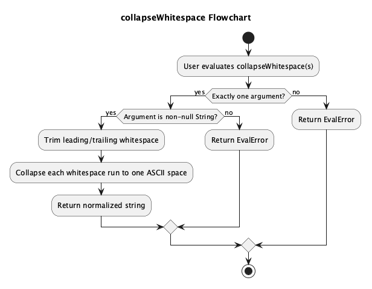
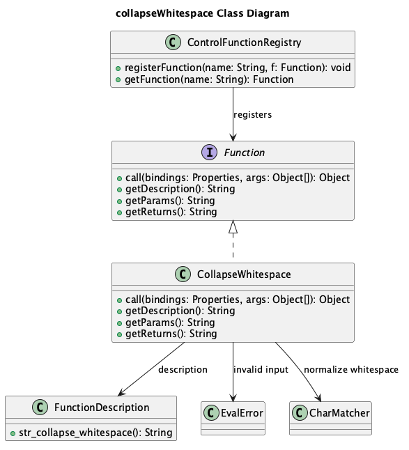
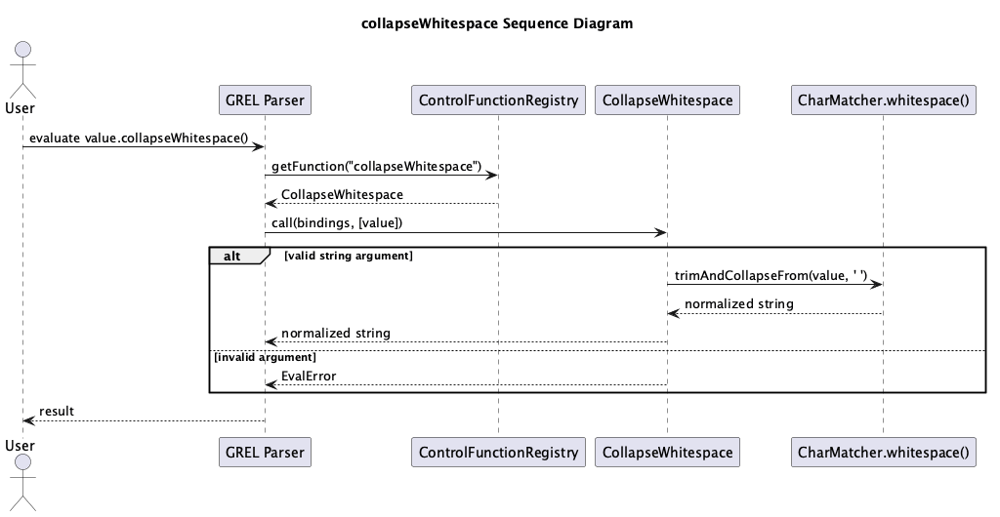

# Submit Individual Pull Request - Zhenyu Song

**Project:** [OpenRefine](https://github.com/OpenRefine/OpenRefine)

**Author:** Zhenyu Song (zhenyus4@uci.edu)

## 1. Design

### Feature Description

The feature adds a new GREL string function, `collapseWhitespace(string s)`, for a common data-cleaning task: normalizing messy whitespace in cell values. The function accepts exactly one non-null string. It trims leading and trailing whitespace, then replaces each internal run of whitespace with one regular space. It returns an `EvalError` when called with missing, null, non-string, or extra arguments.

Example:

```grel
"  New\t York\nCity  ".collapseWhitespace()
```

Result:

```text
New York City
```

### Motivation

Imported data often contains extra spaces, tabs, newlines, or non-breaking spaces. `collapseWhitespace` makes this common cleanup step readable and reusable without requiring a regular expression.

### How It Fits Into OpenRefine

The feature fits into the existing GREL function system: `CollapseWhitespace` implements `Function`, is registered in `ControlFunctionRegistry`, and uses Guava's `CharMatcher.whitespace()` to normalize text. No parser or UI change is needed.

### Detailed Design

#### Flowchart



The flowchart shows the function's decision path: validate the argument count, check that the single argument is a non-null string, normalize the whitespace, and return either the cleaned string or an `EvalError`.

#### Class Diagram



The class diagram shows the main relationships. `CollapseWhitespace` implements the shared `Function` interface, is registered through `ControlFunctionRegistry`, reads its user-facing description from `FunctionDescription`, and uses `CharMatcher` to perform the actual normalization.

#### Sequence Diagram



The sequence diagram shows runtime behavior from the user's expression to the final result. The GREL parser asks the registry for `collapseWhitespace`, invokes the function with the evaluated argument, and receives either a normalized string or an error.

### Limitations

The function is meant for cleanup, not formatting preservation: tabs, newlines, and repeated spaces become one regular space. It also only accepts strings.

### Intermediate Artifacts

PlantUML sources and rendered diagrams are in `./diagram/`.

## 2. Pull Request Link

https://github.com/OpenRefine/OpenRefine/pull/7817

## 3. Project Guidelines Link

https://openrefine.org/docs

## 4. Implementation Reflection

The implementation followed the original design closely. The main strength of the design was its small, focused scope: one reusable GREL function with clear behavior and direct tests.

No major design change was needed. The implementation reused `CharMatcher.whitespace().trimAndCollapseFrom(..., ' ')`, which kept the code simple and aligned with the existing `trim` implementation.

The main limitation is that the function only accepts strings. This keeps behavior predictable, but users who want to normalize numbers or booleans must convert them with `toString()` first.
